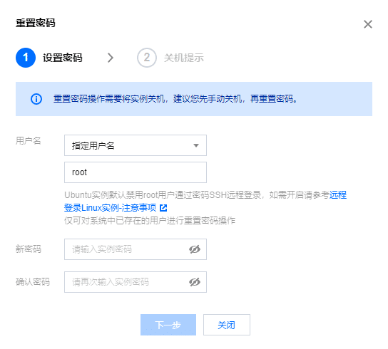

腾讯云云服务器 CVM 与 轻量应用服务器 Lighthouse 的 Ubuntu 实例的默认用户名是 ubuntu，并在安装过程中默认不设置 root 帐户和密码且禁用 root 用户通过密码 SSH 远程登录。如需使用 root 账户，具体操作步骤如下：

## 登录 Ubuntu 实例

使用 SSH 客户端连接您的服务器，**Windows** 下推荐使用 **Xshell/Termius**; **Mac** 下推荐使用 **Termius**; **Linux** ~~直接用 **Shell** 吧~~ 也可以使用 **FinalShell**

如果你尚未设置服务器 SSH 密码，请先前往 **腾讯云>控制台>轻量应用云服务器 Lighthouse>你的实例** 重置密码。

## SSH 配置如下：

- IP: 你服务器的**公网 IP**
- 端口: 默认 **22**
- 用户名: **ubuntu**
- 密码: _你设置的密码_

## 2. 设置 root 密码

Ubuntu 实例在安装过程中默认不设置 root 帐户和密码，需要通过以下步骤手动设置

```shell
sudo passwd root
```

## 3. 输入 root 密码, 按下 Enter

如果你是 Linux 新手，你可能会注意到 SSH 终端并不会显示你的密码。碰到这种情况不用担心，忽略即可~

## 4. 再次输入 root 密码, 按下 Enter

当终端返回以下消息，就说明 root 密码设置完毕

```shell
passwd: password updated successfully
```

## 5. 改变 root 用户 SSH 登录设置

使用 vim 修改 `/etc/ssh/sshd_config` 配置文件

```shell
sudo vim /etc/ssh/sshd_config
```

输入 `i` 进入 INSERT 编辑模式

定位到 `PermitRootLogin` (大概在 35 行) ，删除 # 注释符号，并改为以下代码

```
PermitRootLogin yes
```

在这一行下面，请加入以下代码

```
PasswordAuthentication yes
```

按下 `Esc` 退出 INSERT 编辑模式，输入 `ZZ` 保存并退出

## 6. 重启 SSH 服务

执行以下命令

```shell
sudo service ssh restart
```

## 7. 使用 SSH 客户端登录 root 账户

用户名: root
密码: _你设置的 root 密码_

## Done!

Enjoy!
